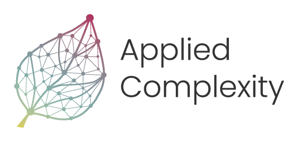

    <h1 style="margin: 0;">Summer School 2024 - Complex Adaptive Systems
    
</h1>

Welcome to the RIVM Summer School 2024 on Complex Adaptive Systems! We're thrilled to have you join us for an immersive and enlightening experience. This program is designed to dive deep into the world of complex systems modeling, offering you a blend of theoretical insights and practical applications.

Throughout the course, you'll have access to a wealth of resources. Each day's folder is packed with valuable materials, including lecture slides, workshop content, and additional reading to enhance your learning journey. Our aim is to provide you with the tools and knowledge needed to explore the intricate dynamics of complex systems.

Whether you're a seasoned professional or new to the field, this summer school will challenge your thinking, expand your skills, and connect you with a community of like-minded learners. We hope you're as excited as we are to embark on this journey together!

# Things to prepare
Before we can start on our journey, we will be using python and its scientific stack. Please  make sure you have a `anaconda`, `conda`, `micromamba`, or `mamba` installed. Follow, the respective guides on the links below for your operating system.

- [Anaconda](https://docs.anaconda.com/anaconda/install/)
- [mamba/mircomamba](https://mamba.readthedocs.io/en/latest/user_guide/micromamba.html)
